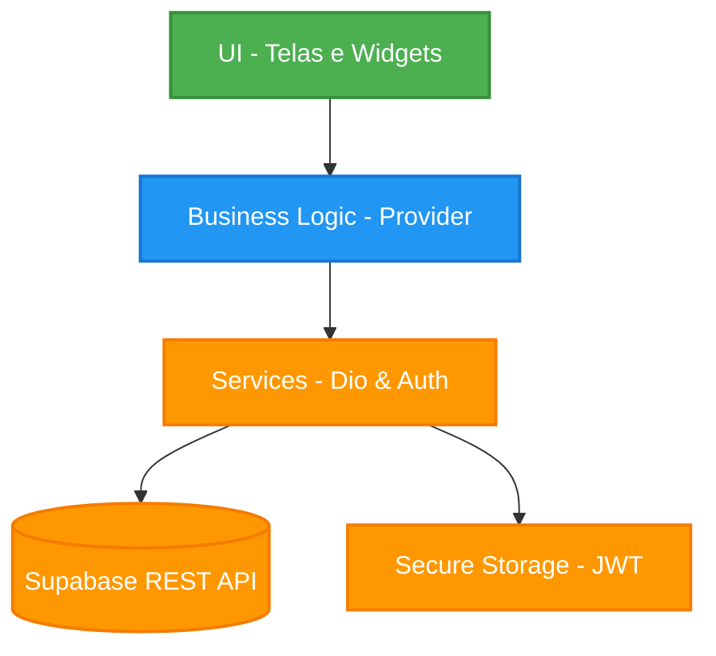
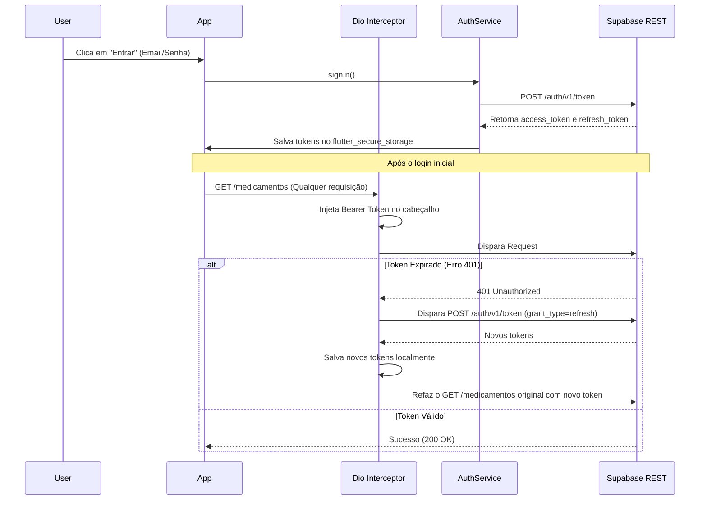

# Documentação de Arquitetura (VA2)

Este documento descreve as decisões arquiteturais, o fluxo de dados, a autenticação e as regras de negócio implementadas na aplicação de Gerenciamento de Medicamentos.

## 1. Diagrama e Separação de Camadas

A aplicação foi desenvolvida baseada no conceito de Clean Architecture, garantindo separação de responsabilidades. A comunicação é unidirecional de fora (UI) para dentro (Serviços/API).

### Explicação dos Padrões e Componentes Utilizados
- **Provider (Gerência de Estado):** O estado da listagem principal (`MedicamentoProvider`) é centralizado, permitindo que a tela atualize a UI de forma reativa assim que a lista retorna do servidor, desacoplando a lógica da `HomeScreen`.
- **Dio (Cliente HTTP):** Escolhido pela facilidade no uso de `Interceptors`. Isso permite que o Bearer Token seja embutido silenciosamente em todas as requisições, centralizando a lógica de rede no `DioClient`.
- **Flutter Secure Storage:** Garante que o armazenamento de sessão (JWT) seja feito nativamente no Keychain (iOS) e Keystore (Android), nunca violando a especificação salvando os dados do domínio localmente.

---

## 2. Fluxo de Autenticação

A segurança é tratada via Access Token (curta duração) e Refresh Token (longa duração). 

---

## 3. Relacionamentos de Dados e Regras de Negócio

### Entidades e Relacionamento (1:N)
O projeto define as entidades `Medicamento` e `HistoricoIngestao`. A relação garante que não tenhamos armazenamento de informações do domínio localmente, sendo consumido do banco relacional de nuvem (PostgreSQL via Supabase).

- **1 Medicamento** tem muitos (`N`) **Históricos de Ingestões**.
- Na interface, ao clicar em "Tomar", o sistema envia um `POST` para criar a tabela filha (`HistoricoIngestao`) passando o `medicamentoId` e validando visualmente a tomada no mesmo dia.

### Regras de Negócio Validadas
O sistema faz a validação preventiva rigorosa no formulário `CadastroScreen` antes de disparar a requisição de criação (`POST`) ou atualização (`PATCH`). As 3 regras validadas e notificadas via interface são:

1. **Obrigatoriedade do Nome:** O medicamento não pode ser cadastrado em branco, enviando feedback visual em vermelho para o usuário no TextField.
2. **Restrição de Comprimento Mínimo:** O nome do medicamento não pode ser uma sigla inválida ou erro de digitação de 1 ou 2 letras; requer estritamente ≥ 3 caracteres.
3. **Obrigatoriedade da Dosagem:** Para evitar acidentes e ajudar o cálculo de IA nas interações medicamentosas, o campo de dosagem (ex: "50mg", "1 comprimido") não pode ser submetido nulo ou vazio.

---

## 4. Justificativas e Decisões Arquiteturais
- **Sem Local Storage para Domínio:** Atendendo rigorosamente à VA2, nenhuma tabela do App (Medicamento, Histórico) foi gerada no SQLite ou SharedPreferences. Se há problemas de rede, o Dio apenas exibe o erro e aguarda re-tentativa. 
- **Google Generative AI:** Optou-se pela SDK do Gemini por fornecer excelente resposta local e integração de Rate Limiting fluida com o modelo `gemini-3.5-flash`, perfeito para parsing de JSON de interações medicamentosas.
